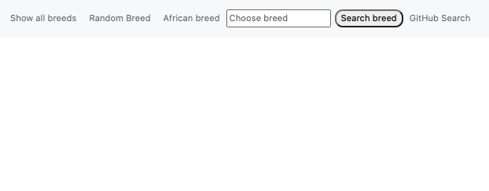
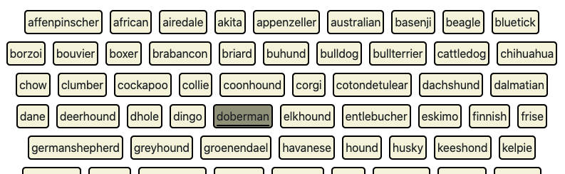
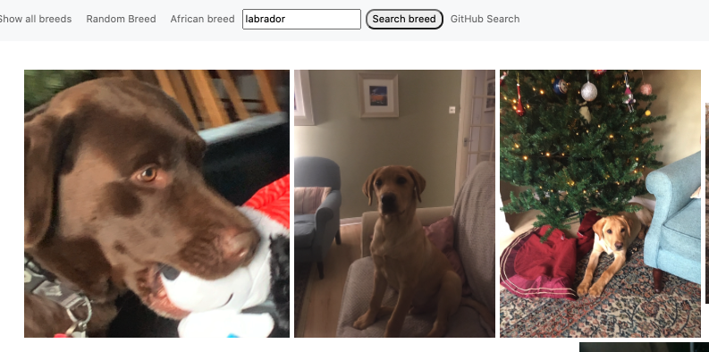
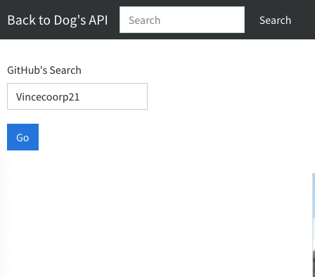

# About The Project -

The main target of this proyect is to learn how to deal with:

- How to work with Axios & understand how asynchrony works.
- Learn How to call an API.

## Dog's Breed API & Git Hub User Search Engine

## Project Objective

### Dog's Breed API

In this project I'm going to work with the collection of breeds hosted in [Dog API](https://dog.ceo/dog-api/).

We will have to browse through the collection of dog breeds to get the following:

- Print the list of breeds of all dogs.
- Print a random image of a breed.
- Print all the images of the african dog breed.
- Search for a specific breed and print all the images on the screen.

### Git Hub User Search Engine

In this project I'm going to work with the collection of users in GitHub [Git Hub Users](https://api.github.com/users/).

We can search for the user's name in the form and it will return a card with their name, their picture and the number of associated repositories.

## Built with...

_This Project was developed with the following technologies_

- HTML
- CSS
- JS
- BootStrap 5

## Getting Started - Installation

To deploy this project you must clone the repository through the following link:

```
https://github.com/Vincecoorp21/Dog-s-Breed-API
```

## Challenges

The main challenges I have found in this project have been related to the extraction of information from the API, And learning how to work with async await.

To achieve this goal I have defined 4 variables according to the information to extract.

```
# code block
const API_URL_ALL = 'https://dog.ceo/api/breeds/list/all';
const API_URL_RANDOM = 'https://dog.ceo/api/breeds/image/random';
const API_URL_PIC = 'https://dog.ceo/api/breed/african/images'; //
const API_URL_BREED = 'https://dog.ceo/api/breed/';

```

Show/hide sections

```
# code block
  breedsDiv.classList.remove('hidden');
  specific_picDiv.classList.add('hidden');
  choosebreed_Div.classList.add('hidden');
  randomDiv.classList.add('hidden');
```

Display the entire collection of a particular breed by screen

```
#code block
const showInput = breeds => {
  breeds.forEach(breed => {
    choosebreed_Div.innerHTML += `<div></div>`;
  });
};
btn_search_breed.addEventListener('click', chooseYourBreed);

```

## Preview







## Author

👤 **Vince BC**

- Twitter: [@VinceTrend](https://twitter.com/VinceTrend)
- Github: [@Vincecoorp21](https://github.com/Vincecoorp21)
- Linkedin:[@vibarcar](https://www.linkedin.com/in/vibarcar/)

This project was developed By [Vicente Barberá - Vince BC -](https://github.com/Vincecoorp21)
